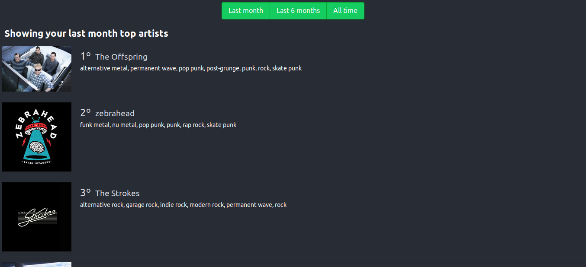

# Rankify
Rankify is a didatic React application which shows your top artists on Spotify. Check the live demo [here](http://nautilus.fabiotheophilo.com)



## Installing

###  Easier way: Docker

Just run the following command:
> docker run -p 8888:8888 ziggoto/rankify:latest

### Self-hosted way

 1. Clone this project
 2. Create your Spotify application at [here](https://developer.spotify.com/dashboard/applications)
 3. Make a `.env`file like this
```
SCOPE=user-top-read
CLIENT_ID=*your client id*
CLIENT_SECRET=*your client secret*
REDIRECT_URI=*your redirect url*
```
 4. Run the app: `npm start`

### That's it :)
